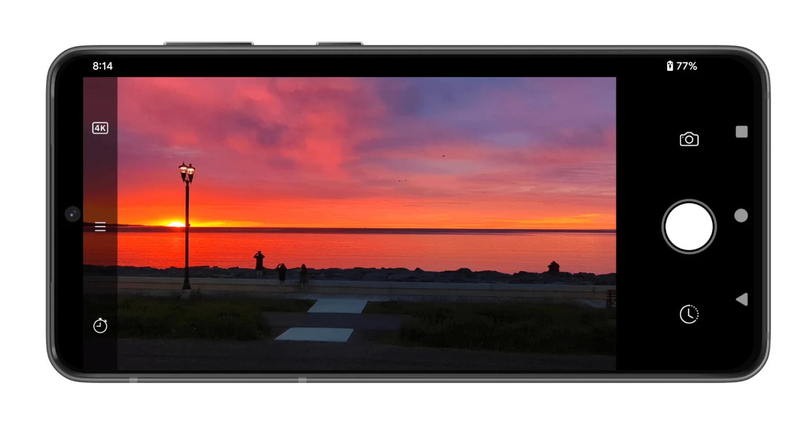

.. Velocity Lapse documentation master file, created by
   sphinx-quickstart on Wed Oct  2 23:51:05 2024.
   You can adapt this file completely to your liking, but it should at least
   contain the root `toctree` directive.

Velocity Lapse
==============

Velocity Lapse is a fully-featured Android app to create stunning time-lapse videos. 

Currently, Velocity Lapse runs on mobile phone and tablets running Android 6 or higher and is available for download from the Google Play store. Some features are dependent on the device hardware and/or software support and may not be available on certain devices. Wherever there is a feature that requires device support, it will be noted in this guide.

.. tip::
   Long pressing on most interface elements will bring up a tooltip.

.. toctree::
   :maxdepth: 2
   :caption: Contents:

   projects/index.rst
   capture_modes/index.rst
   editor.rst
   import.rst
   export.rst
   gallery.rst
   settings.rst
   cookbook.rst
